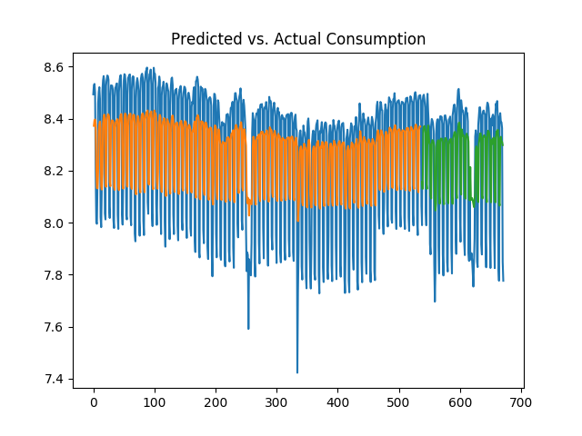
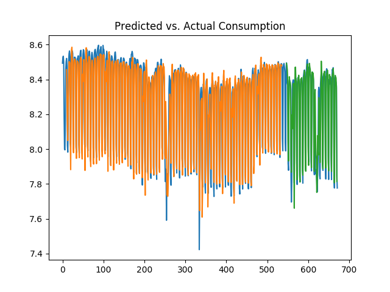

[Home](https://mgcodesandstats.github.io/) |
[Portfolio](https://mgcodesandstats.github.io/portfolio/) |
[Terms and Conditions](https://mgcodesandstats.github.io/terms/) |
[E-mail me](mailto:contact@michaeljgrogan.com) |
[LinkedIn](https://www.linkedin.com/in/michaeljgrogan/)

# Predicting Electricity Consumption Using LSTM Neural Networks

In this example, an LSTM neural network is used to forecast energy consumption of the Dublin City Council Civic Offices using data between April 2011 – February 2013. The original dataset is available from [data.gov.ie](https://data.gov.ie/dataset/energy-consumption-gas-and-electricity-civic-offices-2009-2012/resource/6091c604-8c94-4b44-ac52-c1694e83d746).

## Data Processing

Given the data is presented in 15 minute intervals, daily data was created by summing up the consumption for each day across the 15 minute intervals contained in the original dataset, along with the dataset matrix being formed to allow for a specified number of lags to be regressed against electricity consumption at time *t*. NA values were dropped from the dataset, along with irrelevant columns.

Here is a sample of the original data:


First, the relevant dataset matrix is formed for processing with the LSTM model:

*Dataset Matrix*

```
# Form dataset matrix
def create_dataset(dataset, previous=1):
	dataX, dataY = [], []
	for i in range(len(dataset)-previous-1):
		a = dataset[i:(i+previous), 0]
		dataX.append(a)
		dataY.append(dataset[i + previous, 0])
	return np.array(dataX), np.array(dataY)
```
Then, the data in its original format is cleaned accordingly:

*Data Cleaning*

```
# fix random seed for reproducibility
np.random.seed(7)

# load dataset
df = read_csv('dccelectricitycivicsblocks34p20130221-1840.csv', engine='python', skipfooter=3)
df2=df.rename(columns=df.iloc[0])
df3=df2.drop(df.index[0])
df3
df3.drop(df3.index[0])
df4=df3.drop('Date', axis=1)
df5=df4.drop('Values', axis=1)
df5
df6=df5.dropna()
df7=df6.values
df7
dataset=np.sum(df7, axis=1, dtype=float)
dataset
```
Now, here is a modified numpy array showing the total electricity consumption for each day (with NAs dropped from the model):


## Introduction to LSTM

LSTMs (or long-short term memory networks) allow for analysis of **sequential** or ordered data with long-term dependencies present. Traditional neural networks fall short when it comes to this task, and in this regard an LSTM will be used to predict electricity consumption patterns in this instance. One particular advantage of LSTMs compared to models such as ARIMA, is that the data does not necessarily need to be stationary (constant mean, variance, and autocorrelation), in order for LSTM to analyse the same - even if doing so might result in an increase in performance.

## Autocorrelation Plots, Dickey-Fuller test and Log-Transformation

In order to determine whether **stationarity** is present in our model:

1.  Autocorrelation and partial autocorrelation plots are generated
2.  A Dickey-Fuller test is conducted
3.  The time series is log-transformed and the above two procedures are run once again in order to determine the change (if any) in stationarity

Firstly, here is a plot of the time series:


It is observed that the volatility (or change in consumption from one day to the next) is quite high. In this regard, a logarithmic transformation could be of use in attempting to smooth this data somewhat.

```
from numpy import log
dataset = log(dataset)
```

While the time series remains volatile, the size of the deviations have decreased slightly when expressed in logarithmic format:


The coefficient of variation has decreased significantly to 0.0319, implying that the variability of the trend in relation to the mean is significantly lower than previously.

ACF and PACF plots are generated on the logarithmic data, and a Dickey-Fuller test is conducted. 

**Autocorrelation Plot** 

 

**Partial Autocorrelation Plot** 

 

**Dickey-Fuller Test**

```
>>> # Dickey-Fuller Test
... result = adfuller(logdataset)
>>> print('ADF Statistic: %f' % result[0])
ADF Statistic: -2.804265
>>> print('p-value: %f' % result[1])
p-value: 0.057667
>>> print('Critical Values:')
Critical Values:
>>> for key, value in result[4].items():
...     print('\t%s: %.3f' % (key, value))
... 
	1%: -3.440
	5%: -2.866
	10%: -2.569
```

The p-value for the Dickey-Fuller test has decreased to 0.0576. While this technically does not enter the 5% level of significance threshold necessary to reject the null hypothesis, the logarithmic time series has shown lower volatility based on the CV metric, and therefore this time series is used for forecasting purposes with LSTM.

## Time Series Analysis with LSTM

Now, the LSTM model itself is used for forecasting purposes.

### Data Processing

Firstly, the relevant libraries are imported and data processing is carried out:

```
import numpy as np
import matplotlib.pyplot as plt
from pandas import read_csv
import math
import pylab
from keras.models import Sequential
from keras.layers import Dense
from keras.layers import LSTM
from pandas import Series
from sklearn.preprocessing import MinMaxScaler
from sklearn.metrics import mean_squared_error
import os;
path="filepath"
os.chdir(path)
os.getcwd()
```
The data is now normalised for analysis with the LSTM model, and the time series of *t* is regressed against the series at *t - 50* (a 50 day lag was chosen after experimentation with numerous time intervals):

```
# normalize dataset with MinMaxScaler
scaler = MinMaxScaler(feature_range=(0, 1))
dataset = scaler.fit_transform(dataset)

# Training and Test data partition
train_size = int(len(dataset) * 0.8)
test_size = len(dataset) - train_size
train, test = dataset[0:train_size,:], dataset[train_size:len(dataset),:]

# reshape into X=t-50 and Y=t
previous = 50
X_train, Y_train = create_dataset(train, previous)
X_test, Y_test = create_dataset(test, previous)

# reshape input to be [samples, time steps, features]
X_train = np.reshape(X_train, (X_train.shape[0], 1, X_train.shape[1]))
X_test = np.reshape(X_test, (X_test.shape[0], 1, X_test.shape[1]))
```

### LSTM Generation and Predictions

The model is trained over **100** epochs, and the predictions are generated.

```
model = Sequential()
model.add(LSTM(4, input_shape=(1, previous)))
model.add(Dense(1))
model.compile(loss='mean_squared_error', optimizer='adam')
model.fit(X_train, Y_train, epochs=100, batch_size=1, verbose=2)

trainpred = model.predict(X_train)
testpred = model.predict(X_test)

trainpred = scaler.inverse_transform(trainpred)
Y_train = scaler.inverse_transform([Y_train])
testpred = scaler.inverse_transform(testpred)
Y_test = scaler.inverse_transform([Y_test])
predictions = testpred

trainScore = math.sqrt(mean_squared_error(Y_train[0], trainpred[:,0]))
print('Train Score: %.2f RMSE' % (trainScore))
testScore = math.sqrt(mean_squared_error(Y_test[0], testpred[:,0]))
print('Test Score: %.2f RMSE' % (testScore))

trainpredPlot = np.empty_like(dataset)
trainpredPlot[:, :] = np.nan
trainpredPlot[previous:len(trainpred)+previous, :] = trainpred

testpredPlot = np.empty_like(dataset)
testpredPlot[:, :] = np.nan
testpredPlot[len(trainpred)+(previous*2)+1:len(dataset)-1, :] = testpred

inversetransform, =plt.plot(scaler.inverse_transform(dataset))
trainpred, =plt.plot(trainpredPlot)
testpred, =plt.plot(testpredPlot)
plt.title("Predicted vs. Actual Consumption")
plt.show()
```

### Accuracy

Here is the output when 100 epochs are generated:

```
Epoch 94/100
 - 2s - loss: 0.0406
Epoch 95/100
 - 2s - loss: 0.0406
Epoch 96/100
 - 2s - loss: 0.0404
Epoch 97/100
 - 2s - loss: 0.0406
Epoch 98/100
 - 2s - loss: 0.0406
Epoch 99/100
 - 2s - loss: 0.0403
Epoch 100/100
 - 2s - loss: 0.0406

>>> # Generate predictions
... trainpred = model.predict(X_train)
>>> testpred = model.predict(X_test)
>>> 
>>> # Convert predictions back to normal values
... trainpred = scaler.inverse_transform(trainpred)
>>> Y_train = scaler.inverse_transform([Y_train])
>>> testpred = scaler.inverse_transform(testpred)
>>> Y_test = scaler.inverse_transform([Y_test])
>>> 
>>> # calculate RMSE
... trainScore = math.sqrt(mean_squared_error(Y_train[0], trainpred[:,0]))
>>> print('Train Score: %.2f RMSE' % (trainScore))
Train Score: 0.24 RMSE
>>> testScore = math.sqrt(mean_squared_error(Y_test[0], testpred[:,0]))
>>> print('Test Score: %.2f RMSE' % (testScore))
Test Score: 0.23 RMSE
```

The model shows a root mean squared error of **0.24** on the training dataset, and **0.23** on the test dataset. The mean kilowatt consumption (expressed in logarithmic format) is **8.27**, which means that the error of 0.23 represents less than 3% of the mean consumption. Here is the plot of predicted versus actual consumption: 

 

Interestingly, when the predictions are generated on the raw data (not converted into logarithmic format), the following training and test errors are yielded:

```
>>> # calculate RMSE
... trainScore = math.sqrt(mean_squared_error(Y_train[0], trainpred[:,0]))
>>> print('Train Score: %.2f RMSE' % (trainScore))
Train Score: 840.95 RMSE
>>> testScore = math.sqrt(mean_squared_error(Y_test[0], testpred[:,0]))
>>> print('Test Score: %.2f RMSE' % (testScore))
Test Score: 802.62 RMSE
```

In the context of a mean consumption of 4043 kilowatts per day, the mean squared error for the test score represents nearly 20% of the total mean daily consumption, and is quite high in comparison to that generated on the logarithmic data. That said, it is important to bear in mind that the prediction was made using 1-day of previous data, i.e. Y represents consumption at time t, while X represents consumption at time t-1, as set by the **previous** variable in the code previously. Let's see what happens if this is increased to **10** and **50** days. 

**10 days** 



```
>>> # calculate RMSE
... trainScore = math.sqrt(mean_squared_error(Y_train[0], trainpred[:,0]))
>>> print('Train Score: %.2f RMSE' % (trainScore))
Train Score: 0.08 RMSE
>>> testScore = math.sqrt(mean_squared_error(Y_test[0], testpred[:,0]))
>>> print('Test Score: %.2f RMSE' % (testScore))
Test Score: 0.10 RMSE
```

**50 days** 


```
>>> print('Train Score: %.2f RMSE' % (trainScore))
Train Score: 0.07 RMSE
>>> testScore = math.sqrt(mean_squared_error(Y_test[0], testpred[:,0]))
>>> print('Test Score: %.2f RMSE' % (testScore))
Test Score: 0.11 RMSE
```

We can see that the test error was significantly lower over the 10 and 50-day periods, and the volatility in consumption was much better captured given that the LSTM model took more historical data into account when forecasting. Given the data is in logarithmic format, it is now possible to obtain the true values of the predictions by obtaining the exponent of the data. For instance, the **predictions** variable (or test predictions) is reshaped with (1, -1):

```
>>> predictions.reshape(1,-1)
array([[7.7722197, 8.277015 , 8.458941 , 8.455311 , 8.447589 , 8.445035, 
 ......
8.425287 , 8.404881 , 8.457063 , 8.423954 , 7.98714 , 7.9003944,
8.240862 , 8.41654 , 8.423854 , 8.437414 , 8.397851 , 7.9047146]],
dtype=float32)
```
Using numpy, the exponent is then calculated:

```
>>> np.exp(predictions)
array([[2373.7344],
       [3932.4375],
       [4717.062 ],
......
       [4616.6016],
       [4437.52  ],
       [2710.0288]], dtype=float32)
```

Upon transforming the predictions back to the original format through calculating the exponent, we are now in a position to calculate the percentage error between the predicted and actual consumption, and plot a histogram of the percentage errors.

```
>>> percentage_error=((predictions-Y_test)/Y_test)
>>> percentage_error=abs(percentage_error)
>>> mean=np.mean(percentage_error)
>>> mean
0.061858222621514226
>>> percentage_error=pd.DataFrame(percentage_error)
>>> below10=percentage_error[percentage_error < 0.10].count()
>>> all=percentage_error.count()
>>> np.sum(below10)
71
>>> np.sum(all)
84
>>> plt.hist(percentage_error)
(array([65., 11.,  4.,  2.,  1.,  0.,  0.,  0.,  0.,  1.]), array([3.24421771e-04, 7.22886782e-02, 1.44252935e-01, 2.16217191e-01,
       2.88181447e-01, 3.60145704e-01, 4.32109960e-01, 5.04074217e-01,
       5.76038473e-01, 6.48002729e-01, 7.19966986e-01]), <a list of 10 Patch objects>)
>>> plt.show()
```
**71** of the **84** predictions showed a deviation of less than 10%. Moreover, the mean percentage error was 6.1%, indicating that the model did quite a good job at forecasting electricity consumption.

# Conclusion

For this example, LSTM proved to be quite accurate at predicting fluctuations in electricity consumption. Moreover, expressing the time series in logarithmic format allowed for a smoothing of the volatility in the data and improved the prediction accuracy of the LSTM.
